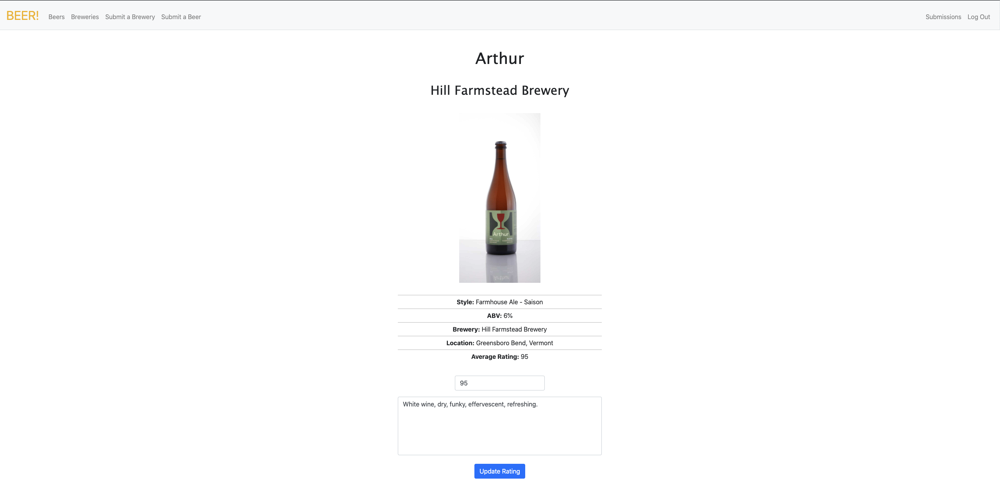

# Beer Ratings!

## Description

Beer rating web app. Users can rate beers in the database, or submit a beer/brewery if their favorite beers aren't already listed!

_Duration: a few weeks, on and off_

## Screen Shot

## Usage

- User can register their account.
- Once logged in, the user can browse the beers and breweries in the database, view the beers they've rated, and submit beers and breweries to the database with admin approval.
- Admin features include a submissions page where they can approve or decline user submissions of breweries and beers.
- Rate the beers in the database. Once you give them a rating, the average rating for that beer will update instantly based on the other ratings stored in the database.
- Users can update their rating for beers they've already rated.

## Built With

HTML, CSS, Python, Django, Flask, Jinja, cs50's ide.

## Acknowledgement
Thanks to [Harvard cs50x](https://cs50.harvard.edu/x/2020/) and all of the professors/assistants whose content is invaluable.
Major thanks to the cs50 discord and anyone that helped me along the way.